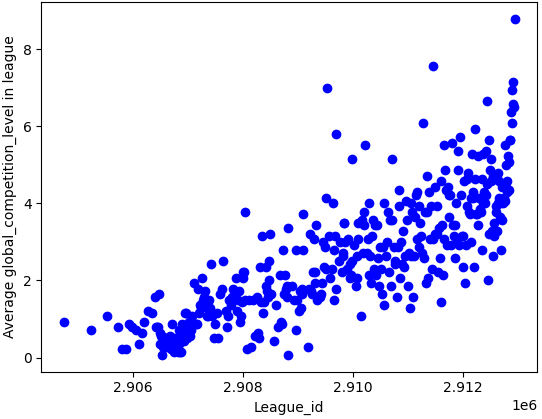
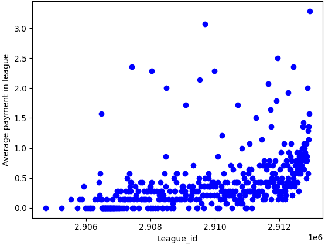
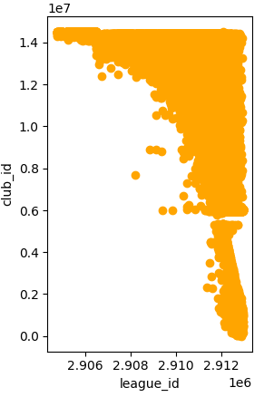
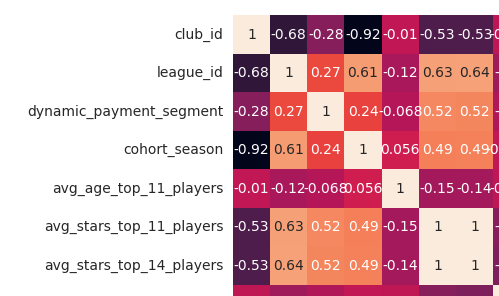
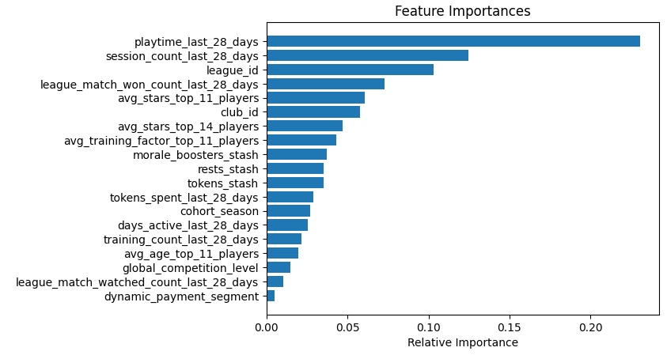
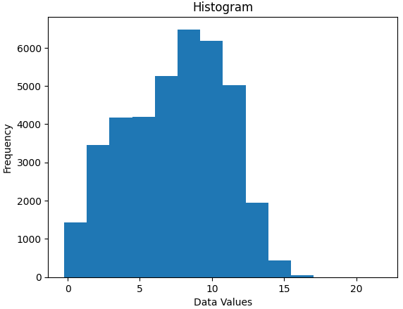

# Submition

Note: my dataset, league_rank_predictions.csv is sorted by 'club_id'

# Copy of package

I wanted to run multiple nootebooks at the same time and in order to avoid repeating code, I created github gist where I had all of functions I want to reuse often in different notebooks. This gist is named package and this notebook copy_of_package is actually just copy of that package.
[Copy_of_package.ipnb](https://github.com/Jankoetf/Nordeus_data_science_challenge/blob/main/Copy_of_Package.ipynb)

# 1. Data analysis - preprocessing - results simulation
- Data analysis:
  
This is all about understanding features, what they represent. These are worthy of attention:
**league_id**: this is not just random generated id, but actually very important feature, it turns out that the bigger this league_id is the better that league_is - clubs in this league are better, we can see that by many corelations like:

 

**club_id** again not just random generated number, but actually this id is generated in order, the bigger this id is that club created later

- Preprocessing

I made two different preprocessing functions, one using both categorical features, one without them, you can see all functions in: 
[Copy_of_package.ipnb](https://github.com/Jankoetf/Nordeus_data_science_challenge/blob/main/Copy_of_Package.ipynb)

- Results simulation

Highest possible MAE is 7, if we generate predictions randomly it is oround 4.63, and if we generate for all predictions 7.5 we get 3.5 for MAE.

# 2. Feature_engineering
- Corelation analysis

- Feature importance:

From many different models we get that playtime_last_28_days is most important feature.

- Feature Selection: 

After analysing corelations between features we get that two feature must be excluded from dataset, these are cohort_season because high corealtion with club_id(and club_id is required for submition), average_stars_top_14_players because of high corelation with average_stars_top_11_players(average_stars_top_11_players have higher importance)

- Feature Engeeniring

Because every feature have strong connection with league_id and predictions should have meaningfull order in the same league, feature engeeniring consist of averaging every feature by league average, and also droping old features except league_id and club_id. [Copy_of_package.ipnb](https://github.com/Jankoetf/Nordeus_data_science_challenge/blob/main/Copy_of_Package.ipynb)

# 3. 4. Neural networks, Regressional models

- Split

I did splitting into train, val, test set both with train_test_split function and manualy leaving grouped property of clubs in the same league, for easier post processing later. [Copy_of_package.ipnb](https://github.com/Jankoetf/Nordeus_data_science_challenge/blob/main/Copy_of_Package.ipynb)

- Hyperparameter tunning

Im using two step tunning aproach - hyperparameters tuning is splited into tuning of architecture parameters and tunning of regularization hyperparameters.

- Post-procesing

We see that every model predict conservatevly around 7.5 when it is unsertain.

In order to transform predictions in meaningfull values I tried different post_processing functions, the simplest one has shown best performance(just rounding predictions in range 1, 14).

# 5. Generating results

Because I find models works best with custom split and post processing functions, I had to change order of columns in my original dataset, so I generated results sorted by club_id for easier testing

## **Thank you for exploring my project!** 
If you'd like to learn more about my background and qualifications, please visit my [LinkedIn profile](https://www.linkedin.com/in/your-profile)
